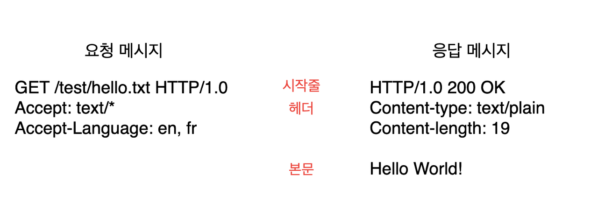

### HTTP (Hypertext Transfer Protocol)

* HTTP는 JPEG, HTML, Text, MPEG, WAV 음성 파일 등 다양한 멀티미디어 데이터를 신뢰성 있게 전송할 수 있는 프로토콜이다.

### 미디어 타입

* 인터넷은 다양한 종류의 데이터 타입을 다루기 때문에, HTTP는 웹에서 전송되는 객체에 대해 MIME 타입이라는 데이터 포맷을 지정한다.
* MIME(Multipurpose Internet Mail Extensions, 다목적 인터넷 메일 확장)
* 웹 서버는 모든 HTTP 객체 데이터에 MIME 타입을 붙인다. 웹브라우저는 서버로부터 객체를 돌려받을 때, 다룰 수 있는 객체인지 MIME 타입을 통해 확인한다.
* MIME 타입은 '/'로 구분된 primary object type과 specific subtype으로 이루어진 문자열 라벨이다.
  * HTML -> text/html
  * plain ASCII -> text/plain
  * JPEG -> image/jpeg
  * GIF -> image/gif
  * 애플 퀵타임 동영상 -> video/quicktime
  * 마이크로소프트 파워포인트 프레젠테이션 -> application/vnd.ms-powerpoint

### URI (Uniform Resource Identifier) - 통합 자원 식별자

* 서버의 리소스에 대한 식별자 이름이다.
* 정보 리소스를 고유하게 식별하고 위치를 지정한다.
* URI에는 URL과 URN이라는 두 가지 종류의 자원 식별자가 있다.

### URL (Uniform Resource Locator) - 통합 자원 지시자

* URL은 특정 서버의 한 리소스에 대한 구체적인 위치를 서술한다.
* 대부분의 URL은 세 부분으로 이루어진 표준 포맷을 따른다.
  * 1\. 스킴(Scheme) - 리소스에 접근하기 위해 사용되는 프로토콜을 서술한다. ex) HTTP
  * 2\. 서버의 인터넷 주소. ex) www.abcd.com
  * 3\. 웹 서버의 리소스. ex) /hello/world.gif

### URN (Uniform Resource Name, URN)

* 콘텐츠를 이루는 한 리소스에 대해, 그 리소스의 위치에 영향을 받지 않는 유일한 이름 역할을 한다.
* URN은 리소스를 여기저기 옮기더라도 문제없이 동작한다. (리소스의 이름이 변하지 않게 유지하는 한, 여러 종류의 네트워크 접속 프로토콜로 접근해도 문제 없다.
* URN은 널리 채택되지 않았고, 대부분의 URI는 URL이다.

### 메서드

* 모든 HTTP 요청 메시지는 한 개의 메서드를 갖는다.
* 메서드는 서버에게 어떤 동작이 취해져야 하는지 말해준다.
* HTTP 메서드 - GET, PUT, DELETE, POST, HEAD 등...

### 상태 코드

* 상태 코드는 클라이언트의 요청에 대한 결과의 상태를 알려준다.
* HTTP는 각 숫자 상태 코드에 텍스트로 구성된 "사유 구절(reason phrase)"도 함께 보낸다. 이 구문은 단지 설명만을 위해서 포함된 것일 뿐 실제 응답 처리에는 상태 코드가 사용된다.
  * 200 OK
  * 200 Document attached

### 메시지

* 메시지는 위와 같이 세 부분으로 이루어져 있다.
* 시작줄 : 요청이라면 무엇을 해야 하는지, 응답이라면 무슨 일이 일어났는지 나타낸다.
* 헤더 : 시작줄 다음에는 0개 이상의 헤더 필드가 이어진다.
* 본문 : 빈 줄 다음에 어떤 종류의 데이터든 들어갈 수 있는 메시지 본문이 필요에 따라 올 수 있다. 문자열이면서 구조적인 시작줄이나 헤더와 달리, 본문은 임의의 이진 데이터를 포함할 수 있다(이미지, 비디오, 오디오 트랙, 응용 소프트웨어).

### TCP/IP

* HTTP는 애플리케이션 계층 프로토콜이다.
* HTTP는 신뢰성 있는 인터넷 전송을 위해 TCP/IP에 맡긴다.
* 데이터 전송에 있어서 신뢰성을 보장한다.
* TCP/IP는 각 네트워크와 하드웨어의 특성을 숨기고, 어떤 종류의 컴퓨터나 네트워크든 서로 신뢰성 있는 의사소통을 할 수 있게 해준다.
* TCP 커넥션이 맺어지고 나면, 클라이언트와 서버 간에 교환되는 메시지가 유실되거나, 손상되거나, 순서가 뒤바뀌어 수신되는 일이 없다.

### 프로토콜 버전

#### HTTP/0.9

* HTTP/0.9는 오직 GET 메서드만 지원하고, 멀티미디어 콘텐츠에 대한 MIME 타입이나, HTTP 헤더, 버전 번호는 지원하지 않는다. HTTP/0.9는 원래 간단한 HTML을 받아오기 위해 만들어진 것이다. HTTP/0.9는 HTTP/1.0으로 대체되었다.

#### HTTP/1.0

* HTTP/1.0는 버전 번호, HTTP 헤더, 추가 메서드, 멀티미디어 객체 처리를 추가했다. HTTP/1.0은 시각적으로 매력적인 웹페이지와 상호작용하는 폼을 실현했고, 월드 와이드 웹을 대세로 만들었다.

#### HTTP/1.0+

* 월드 와이드 웹이 급격히 팽창하고 상업적으로도 성공하면서 여러 가지의 요구를 만족시키기 위해 HTTP에 기능이 추가되었다. keep-alive 커넥션, 가상 호스팅 지원, 프락시 연결 지원을 포함해 많은 기능이 공식적이진 않지만 사실상 표준으로 HTTP에 추가되었다.

### HTTP/2.0

* HTTP/2.0은, HTTP/1.1 성능 문제를 개선하기 위해 구글 SPDY 프로토콜을 기반으로 설계된 프로토콜이다.

---

## 참고자료

[HTTP 완벽 가이드 - 교보문고](http://www.kyobobook.co.kr/product/detailViewKor.laf?ejkGb=KOR&mallGb=KOR&barcode=9788966261208&orderClick=LEA&Kc=)